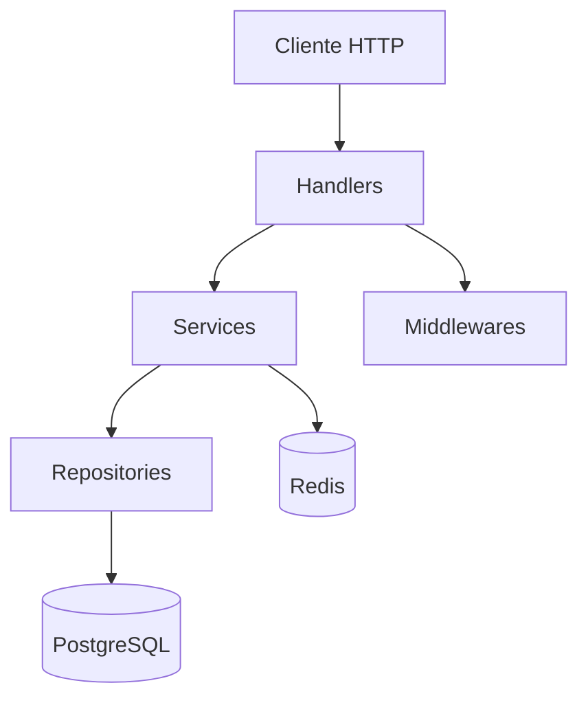
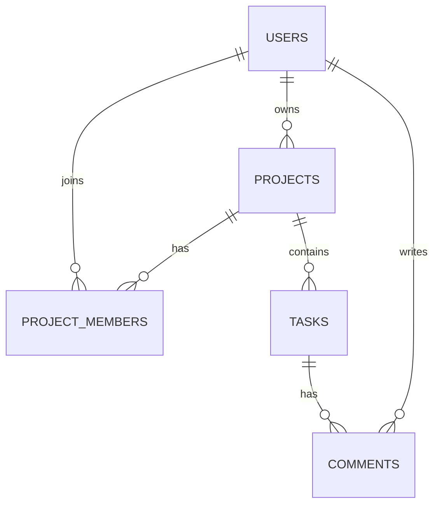

# Project Management API

API REST em **Go** para gerenciamento de projetos, tarefas, membros e comentários.

Este repositório é um projeto de portfólio backend júnior com foco em Go, PostgreSQL, Docker, autenticação, testes, documentação técnica e deploy básico.

## Objetivo

Construir uma API backend realista para demonstrar competências práticas exigidas em uma primeira vaga como desenvolvedor backend júnior.

O projeto cobre:

- API REST em Go;
- arquitetura em camadas;
- PostgreSQL;
- migrations;
- autenticação com JWT;
- hash de senha com bcrypt;
- Docker e Docker Compose;
- testes unitários e de integração;
- documentação Swagger/OpenAPI;
- Redis para cache;
- healthcheck, readiness e logs estruturados;
- deploy em cloud.

## Stack técnica

| Categoria | Tecnologia |
|---|---|
| Linguagem | Go |
| Router HTTP | chi ou net/http |
| Banco de dados | PostgreSQL |
| Driver PostgreSQL | pgx |
| Migrations | golang-migrate |
| Autenticação | JWT |
| Hash de senha | bcrypt |
| Cache | Redis |
| Testes | testing, testify |
| Documentação | Swagger/OpenAPI |
| Containers | Docker, Docker Compose |
| Logs | slog |
| Lint | golangci-lint |
| Deploy | Render, Railway, Fly.io, VPS ou AWS Lightsail |

## Arquitetura



### Camadas

| Camada | Responsabilidade |
|---|---|
| `handler` | Receber requisições HTTP e retornar respostas. |
| `service` | Concentrar regras de negócio, validações e permissões. |
| `repository` | Executar operações no banco de dados. |
| `model` | Definir entidades e DTOs. |
| `middleware` | Autenticação, logs, request ID e interceptação de requisições. |
| `config` | Carregar configurações da aplicação. |

## Funcionalidades planejadas

- Cadastro de usuários.
- Login com JWT.
- Hash de senha com bcrypt.
- CRUD de projetos.
- CRUD de tarefas.
- Associação de membros a projetos.
- Comentários em tarefas.
- Controle básico de permissões.
- Paginação e filtros.
- Tratamento padronizado de erros.
- Migrations SQL.
- Testes unitários.
- Testes de integração.
- Documentação Swagger/OpenAPI.
- Cache com Redis.
- Healthcheck e readiness check.

## Modelo de domínio



## Endpoints planejados

### Autenticação

| Método | Rota | Descrição | Auth |
|---|---|---|---|
| `POST` | `/auth/register` | Cadastra usuário | Não |
| `POST` | `/auth/login` | Autentica usuário e retorna token | Não |
| `GET` | `/me` | Retorna usuário autenticado | Sim |

### Projetos

| Método | Rota | Descrição | Auth |
|---|---|---|---|
| `POST` | `/projects` | Cria projeto | Sim |
| `GET` | `/projects` | Lista projetos do usuário | Sim |
| `GET` | `/projects/{id}` | Busca projeto por ID | Sim |
| `PUT` | `/projects/{id}` | Atualiza projeto | Sim |
| `DELETE` | `/projects/{id}` | Remove projeto | Sim |

### Tarefas

| Método | Rota | Descrição | Auth |
|---|---|---|---|
| `POST` | `/projects/{id}/tasks` | Cria tarefa no projeto | Sim |
| `GET` | `/projects/{id}/tasks` | Lista tarefas do projeto | Sim |
| `GET` | `/tasks/{id}` | Busca tarefa por ID | Sim |
| `PUT` | `/tasks/{id}` | Atualiza tarefa | Sim |
| `DELETE` | `/tasks/{id}` | Remove tarefa | Sim |

## Estrutura de diretórios

```text
project-management-api-go/
├── cmd/api/
├── internal/config/
├── internal/handler/
├── internal/service/
├── internal/repository/
├── internal/model/
├── internal/middleware/
├── internal/validator/
├── migrations/
├── docs/
├── scripts/
├── test/integration/
├── Dockerfile
├── docker-compose.yml
├── .env.example
├── Makefile
├── go.mod
└── README.md
```

## Como executar localmente

```bash
git clone https://github.com/robert-kennedy-devops/project-management-api-go.git
cd project-management-api-go
cp .env.example .env
docker compose up --build
```

Healthcheck:

```bash
curl http://localhost:8080/health
```

Resposta esperada:

```json
{
  "status": "ok"
}
```

## Testes

```bash
go test ./...
```

Com cobertura:

```bash
go test ./... -cover
```

## Docker

```bash
docker compose up --build
```

Serviços previstos:

- `api`
- `postgres`
- `redis`

## Roadmap

- [x] Criar estrutura base do projeto.
- [x] Implementar `/health`.
- [ ] Implementar `/ready`.
- [ ] Configurar PostgreSQL.
- [ ] Criar migrations iniciais.
- [ ] Implementar cadastro e login.
- [ ] Implementar middleware de autenticação.
- [ ] Implementar CRUD de projetos.
- [ ] Implementar membros de projeto.
- [ ] Implementar CRUD de tarefas.
- [ ] Implementar comentários.
- [ ] Adicionar testes unitários.
- [ ] Adicionar testes de integração.
- [ ] Adicionar Swagger/OpenAPI.
- [ ] Adicionar Redis para cache.
- [ ] Fazer deploy.

## Decisões técnicas

### Por que Go?

Go foi escolhido por ser simples, compilado, performático e adequado para APIs, microsserviços e aplicações cloud-native.

### Por que PostgreSQL?

PostgreSQL é robusto, relacional, open source e amplamente utilizado no mercado.

### Por que arquitetura em camadas?

A separação entre handlers, services e repositories facilita manutenção, testes e evolução do código.

### Por que Docker Compose?

Docker Compose padroniza o ambiente local e permite executar API, banco e cache com poucos comandos.

## Autor

Robert Kennedy

- GitHub: https://github.com/robert-kennedy-devops
- LinkedIn: https://www.linkedin.com/in/robert-kennedy-034687369
- E-mail: robert_unix@email.com

## Licença

MIT
